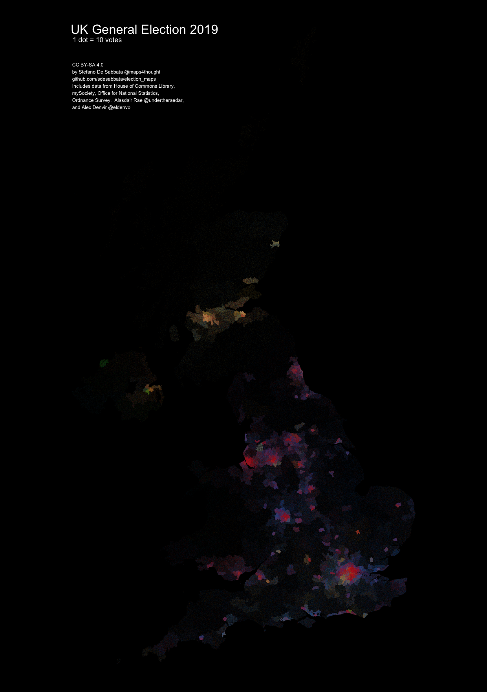

# Election maps

The 2019 UK General Election dot map provides an overview of the geographic distribution of votes cast per UK constituency during the 2019 UK General Election and its intersection with population density. Each dot represents 10 votes cast for one party in a constituency, and it is colour coded by the [party colour](https://en.wikipedia.org/wiki/Wikipedia:Index_of_United_Kingdom_political_parties_meta_attributes).

The map combines [election results data](https://drive.google.com/file/d/19Z1YbmmjzDqMl2rzrk0XTfNrbRJDAMtU/view) ([not verified](https://twitter.com/eldenvo/status/1205525303092756482)) by [Alex Denvir](https://twitter.com/eldenvo) and [UK constituencies geographic data](https://github.com/alasdairrae/wpc) by [Alasdair Rae](https://twitter.com/undertheraedar).

## Instructions

To reproduce the dot maps, clone this repository, check the requirements detailed below, and execute the main `Make.R` script.

### Requirements

The scripts included in this repository require `git` to be installed, to retrieve the UK constituencies geographic data from Alasdair Rae's [wpc repository](https://github.com/alasdairrae/wpc), as well as the following R libraries:

- [`tidyverse`](https://www.tidyverse.org/)
- [`googledrive`](https://googledrive.tidyverse.org/)
    - used to retrieve the [election results data](https://drive.google.com/file/d/19Z1YbmmjzDqMl2rzrk0XTfNrbRJDAMtU/view) by Alex Denvir
    - requires granting Tidyverse API Packages permission to see, edit, create and delete all of your Google Drive files
- [`rgdal`](https://cran.r-project.org/web/packages/rgdal/index.html)
- [`sp`](https://cran.r-project.org/web/packages/sp/index.html)
- [`maptools`](https://cran.r-project.org/web/packages/maptools/index.html)
- [`tmap`](https://cran.r-project.org/web/packages/tmap/index.html)
